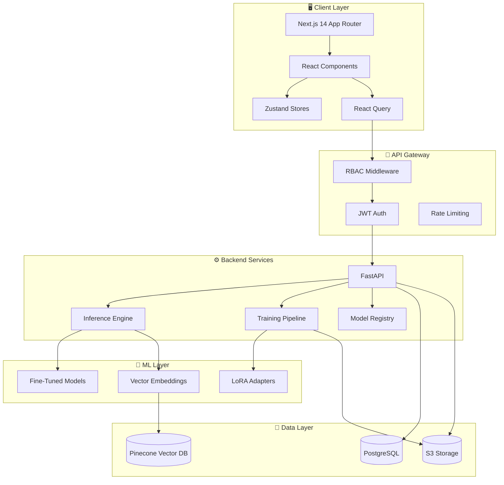

<div align="center">
  
  
  <h1 style="margin-top: 0;">AuditIQ 🔍</h1>
  
  <p><b>"Fine-Tuned for Financial Truth."</b></p>
  
  <p>A production-grade, ML-driven financial document extraction platform leveraging fine-tuned transformer models for automated data extraction, classification, and compliance analysis.</p>

  <p>
    <a href="https://github.com/Anudeepsrib/AuditIQ">
      
    </a>
    <a href="https://github.com/Anudeepsrib/AuditIQ">
      
    </a>
    <a href="https://github.com/Anudeepsrib/AuditIQ/blob/main/LICENSE">
      
    </a>
  </p>

  <p>
    <a href="#-core-features">Features</a> •
    <a href="#-quick-start">Quick Start</a> •
    <a href="#%EF%B8%8F-tech-stack">Tech Stack</a> •
    <a href="#-architecture">Architecture</a> •
    <a href="#-models--fine-tuning">Models</a>
  </p>
  
  <a href="https://github.com/Anudeepsrib/AuditIQ">
    
  </a>
</div>

---

## 🔒 Enterprise-Grade Security & Compliance

AuditIQ is engineered for environments where data integrity and auditability are non-negotiable.

<table>
  <tr>
    <td width="50%" valign="top">
      <h3>🔐 JWT Authentication</h3>
      <p>Secure token-based auth with httpOnly cookies, refresh token rotation, and configurable expiry policies.</p>
    </td>
    <td width="50%" valign="top">
      <h3>🛡️ Role-Based Access Control</h3>
      <p>Granular RBAC with four tiers — Admin, ML Engineer, Analyst, and Auditor — enforced at both API and UI middleware layers.</p>
    </td>
  </tr>
  <tr>
    <td width="50%" valign="top">
      <h3>📜 Immutable Audit Trail</h3>
      <p>Every user action, model promotion, and inference request is logged to a tamper-evident audit log for full regulatory compliance.</p>
    </td>
    <td width="50%" valign="top">
      <h3>⚡ Rate Limiting</h3>
      <p>Built-in API rate limiting via SlowAPI to prevent abuse and ensure fair resource allocation across tenants.</p>
    </td>
  </tr>
</table>

---

## ✨ Core Features

<table>
  <tr>
    <td width="33%" valign="top">
      <b>📄 Document Extraction</b><br/>
      Automated high-precision field extraction from financial documents using fine-tuned transformer models with token-level confidence scoring.
    </td>
    <td width="33%" valign="top">
      <b>🗂️ Model Registry</b><br/>
      Full lifecycle management with stage transitions (Dev → Staging → Production), version control, and MLflow integration.
    </td>
    <td width="33%" valign="top">
      <b>🏋️ Training Pipeline</b><br/>
      Automated fine-tuning workflows with PEFT/LoRA, dataset versioning, and hyperparameter tracking — all managed through the UI.
    </td>
  </tr>
  <tr>
    <td width="33%" valign="top">
      <b>📊 Evaluation Framework</b><br/>
      Comprehensive metrics dashboard with the critical <b>Going Concern Recall (GCR) Gate</b> — requiring 95% recall before production promotion.
    </td>
    <td width="33%" valign="top">
      <b>🎨 Premium Dark UI</b><br/>
      A clinical, purpose-built interface with Syne + IBM Plex Mono typography, teal accent system, and progress ring visualizations.
    </td>
    <td width="33%" valign="top">
      <b>🔍 Intelligent Classification</b><br/>
      Multi-class document classification with vector embeddings via Pinecone for semantic search and similarity matching.
    </td>
  </tr>
</table>

---

## 🚀 Quick Start

Get up and running locally in under 5 minutes.

### 1. Prerequisites
- **Node.js** 18+
- **Python** 3.11+
- **SQLite** (bundled) or PostgreSQL

### 2. Clone & Bootstrap
```bash
git clone https://github.com/Anudeepsrib/AuditIQ.git
cd AuditIQ

# ── Backend Setup ──
cd auditiq
python -m venv venv

# macOS/Linux:
source venv/bin/activate
# Windows:
.\venv\Scripts\activate

pip install -r requirements.api.txt
cp .env.example .env
# Edit .env with your JWT secret and config

# ── Frontend Setup ──
cd ../auditiq-ui
npm install
```

### 3. Launch
Launch two terminal windows to start the backend engine and frontend interface.

**Terminal 1 — FastAPI Backend:**
```bash
cd auditiq
source venv/bin/activate  # Windows: .\venv\Scripts\activate
python -m uvicorn app.main:app --reload
```

**Terminal 2 — Next.js Frontend:**
```bash
cd auditiq-ui
npm run dev
```

Open [http://localhost:3000](http://localhost:3000) to begin processing documents.

---

## 🛠️ Tech Stack

<table>
  <tr>
    <th width="50%">Frontend (App Router)</th>
    <th width="50%">Backend (ML Engine)</th>
  </tr>
  <tr>
    <td valign="top">
      <ul>
        <li><b>Framework:</b> Next.js 14 (App Router, RSC)</li>
        <li><b>Styling:</b> Tailwind CSS + shadcn/ui</li>
        <li><b>State:</b> Zustand (client) + TanStack Query (server)</li>
        <li><b>Forms:</b> React Hook Form + Zod</li>
        <li><b>Charts:</b> Recharts</li>
        <li><b>Language:</b> TypeScript (Strict)</li>
      </ul>
    </td>
    <td valign="top">
      <ul>
        <li><b>API:</b> FastAPI (Python 3.11+)</li>
        <li><b>ML:</b> PyTorch + Transformers + PEFT/LoRA</li>
        <li><b>Database:</b> SQLAlchemy + Alembic</li>
        <li><b>Tracking:</b> MLflow</li>
        <li><b>Vector Store:</b> Pinecone</li>
        <li><b>Logging:</b> Structlog</li>
      </ul>
    </td>
  </tr>
</table>

---

## 🏗️ Architecture



---

## 🧠 Models & Fine-Tuning

AuditIQ uses fine-tuned transformer models optimized for financial document understanding. The **Going Concern Recall (GCR) Gate** ensures no model reaches production without achieving **≥ 95% recall** on critical risk fields.

| Stage | Description | GCR Requirement |
|-------|-------------|-----------------|
| **🔧 Dev** | Active development & experimentation | None |
| **🧪 Staging** | Pre-production validation & testing | ≥ 90% |
| **🚀 Production** | Live inference endpoint | **≥ 95%** |

---

## 👥 Role-Based Access Control

| Role | Inference | Models | Training | Datasets | Evaluations | Audit Log | Settings |
|------|:---------:|:------:|:--------:|:--------:|:-----------:|:---------:|:--------:|
| **Admin** | ✅ | ✅ | ✅ | ✅ | ✅ | ✅ | ✅ |
| **ML Engineer** | ❌ | ✅ | ✅ | ✅ | ✅ | ❌ | ❌ |
| **Analyst** | ✅ | 👁️ | ❌ | ❌ | 👁️ | ❌ | ❌ |
| **Auditor** | ❌ | 👁️ | ❌ | ❌ | 👁️ | ✅ | ❌ |

<sub>✅ Full Access &nbsp;|&nbsp; 👁️ Read-Only &nbsp;|&nbsp; ❌ No Access</sub>

---

## 🎨 Design System

<table>
  <tr>
    <td width="50%" valign="top">
      <h3>Color Palette</h3>
      <ul>
        <li><b>Background:</b> <code>#0D1117</code> (Dark clinical)</li>
        <li><b>Surface:</b> <code>#161B22</code></li>
        <li><b>Accent:</b> <code>#00D4AA</code> (Teal)</li>
        <li><b>Success:</b> <code>#3B9C5A</code></li>
        <li><b>Error:</b> <code>#F85149</code></li>
      </ul>
    </td>
    <td width="50%" valign="top">
      <h3>Typography</h3>
      <ul>
        <li><b>Headings:</b> Syne (Sans-serif)</li>
        <li><b>Body:</b> Inter (Sans-serif)</li>
        <li><b>Monospace:</b> IBM Plex Mono (Metrics, code)</li>
      </ul>
    </td>
  </tr>
</table>

---

## ⚙️ Configuration

Your instance can be customized entirely via the `auditiq/.env` file:

```env
# App
APP_NAME=AuditIQ
APP_VERSION=0.1.0
DEBUG=false

# Database (SQLite for dev, PostgreSQL for production)
DATABASE_URL=sqlite:///./auditiq.db

# JWT Authentication (CHANGE IN PRODUCTION!)
JWT_SECRET_KEY=CHANGE-ME-TO-A-RANDOM-64-CHAR-STRING
JWT_ALGORITHM=HS256
ACCESS_TOKEN_EXPIRE_MINUTES=60

# MLflow Tracking
MLFLOW_TRACKING_URI=http://localhost:5000

# CORS Origins
CORS_ORIGINS=["http://localhost:3000","http://localhost:8000"]

# Rate Limiting
RATE_LIMIT_PER_MINUTE=100
```

---

## 📂 Project Structure

```
AuditIQ/
├── auditiq/                      # Python FastAPI backend
│   ├── app/                      # Application source
│   ├── alembic/                  # Database migrations
│   ├── tests/                    # Backend test suite
│   ├── requirements.api.txt      # Python dependencies
│   ├── Dockerfile.api            # Container definition
│   └── docker-compose.yml        # Multi-service orchestration
│
├── auditiq-ui/                   # Next.js 14 frontend
│   ├── app/                      # App Router pages
│   │   ├── (auth)/               # Auth route group (login)
│   │   └── (dashboard)/          # Dashboard routes
│   │       ├── inference/        # Document extraction UI
│   │       ├── models/           # Model registry
│   │       ├── training/         # Training pipeline
│   │       ├── dataset/          # Dataset management
│   │       ├── evaluations/      # Evaluation dashboard
│   │       ├── audit/            # Audit log
│   │       └── settings/         # Settings & user management
│   ├── components/               # Reusable React components
│   ├── lib/                      # Utilities, hooks, stores, types
│   └── middleware.ts             # RBAC route protection
│
└── README.md
```

---

## ⚠️ Disclaimer
**Professional Use Only:** AuditIQ is an engineering project for automated financial document processing. It does **not** replace professional auditing services, certified financial analysis, or regulatory compliance consulting. Users should verify all extracted data against source documents before relying on outputs for decision-making.

---

<div align="center">
  <p>Built with ❤️ for Financial Truth.</p>
</div>
