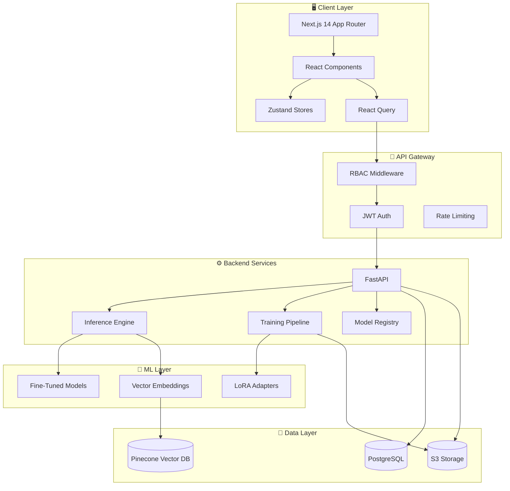

# AuditIQ


> **Fine-Tuned for Financial Truth**

A production-grade financial document extraction platform leveraging fine-tuned transformer models for automated data extraction, classification, and analysis from financial documents.

## Overview

AuditIQ is an end-to-end platform for ML-driven financial document processing. It combines a Next.js 14 frontend with a Python-based ML backend to provide:

- **Document Extraction**: Automated field extraction from financial documents with high precision
- **Model Registry**: Version control and deployment management for fine-tuned models
- **Training Pipeline**: Automated fine-tuning workflows with dataset versioning
- **Evaluation Framework**: Comprehensive metrics tracking including Going Concern Recall (GCR) gating
- **Audit Trail**: Complete user activity logging for compliance

## Tech Stack

### Frontend
- **Framework**: Next.js 14 (App Router, React Server Components)
- **Language**: TypeScript (Strict mode)
- **Styling**: Tailwind CSS with CSS custom properties
- **State Management**: Zustand (client), React Query (server)
- **Forms**: React Hook Form + Zod validation
- **UI Components**: shadcn/ui
- **Icons**: Lucide React
- **Fonts**: IBM Plex Mono, Syne, Inter

### Backend
- **API**: FastAPI (Python)
- **ML**: PyTorch, Transformers, PEFT/LoRA
- **Database**: PostgreSQL
- **Vector Store**: Pinecone
- **Storage**: S3-compatible object storage

## Project Structure

```
AuditIQ/
├── auditiq-ui/                 # Next.js frontend
│   ├── app/                    # App Router pages
│   │   ├── (auth)/             # Auth route group (login)
│   │   ├── (dashboard)/          # Dashboard route group
│   │   │   ├── inference/        # Document extraction UI
│   │   │   ├── models/           # Model registry
│   │   │   ├── training/         # Training pipeline
│   │   │   ├── dataset/          # Dataset management
│   │   │   ├── evaluations/      # Evaluation dashboard
│   │   │   ├── audit/            # Audit log
│   │   │   └── settings/         # Settings & user management
│   │   ├── api/                  # API routes (auth)
│   │   ├── globals.css           # Global styles + CSS variables
│   │   ├── layout.tsx            # Root layout
│   │   └── providers.tsx         # React Query + Sonner providers
│   ├── components/
│   │   ├── layout/               # Sidebar, Topbar, PageHeader
│   │   ├── auth/                 # LoginForm
│   │   ├── inference/            # ExtractionForm, ResultPanel, etc.
│   │   ├── models/               # ModelRegistryTable, ModelStageBadge
│   │   └── ui/                   # Button, Input, Label, etc.
│   ├── lib/
│   │   ├── api/                  # Axios client + API functions
│   │   ├── hooks/                # React Query hooks
│   │   ├── stores/               # Zustand stores
│   │   ├── types/                # TypeScript interfaces
│   │   └── utils/                # Helper functions
│   ├── middleware.ts             # RBAC protection
│   ├── tailwind.config.ts
│   ├── tsconfig.json
│   └── package.json
└── backend/                      # Python FastAPI backend (separate)
```

## Getting Started

### Prerequisites
- Node.js 18+ 
- npm or pnpm
- Backend API running (see backend README)

### Installation

```bash
# Navigate to frontend directory
cd auditiq-ui

# Install dependencies
npm install

# Set up environment variables
cp .env.example .env.local
# Edit .env.local with your API URL
```

### Environment Variables

```env
NEXT_PUBLIC_API_URL=http://localhost:8000
```

### Development

```bash
# Run dev server
npm run dev

# Open http://localhost:3000
```

### Build

```bash
npm run build
```

## Features

### Role-Based Access Control (RBAC)

| Role | Permissions |
|------|-------------|
| **Admin** | Full access to all features |
| **ML Engineer** | Models, Training, Dataset, Evaluations |
| **Analyst** | Inference, Models (read-only), Evaluations (read-only) |
| **Auditor** | Audit Log, Models (read-only), Evaluations (read-only) |

### Going Concern Recall (GCR) Gate

A critical safety mechanism requiring **95% recall** on the going_concern_risk field before a model can be promoted to production. This gate is prominently displayed throughout the model registry UI.

### Key UI Components

- **Inference Interface**: Real-time document extraction with token counting and model selection
- **Model Registry**: Version management with stage transitions (dev → staging → production)
- **Progress Rings**: Visual recall indicators with color-coded thresholds
- **Session History**: Track inference requests during active sessions

## Design System

### Color Palette
- **Background**: `#0D1117` (Dark clinical)
- **Surface**: `#161B22`
- **Accent**: `#00D4AA` (Teal)
- **Success**: `#3B9C5A`
- **Error**: `#F85149`

### Typography
- **Headings**: Syne (Sans-serif)
- **Body**: Inter (Sans-serif)
- **Monospace**: IBM Plex Mono (Metrics, code)

## API Integration

The frontend communicates with a FastAPI backend via:

- **Authentication**: JWT tokens in httpOnly cookies
- **Document Processing**: `/api/v1/inference/extract`, `/api/v1/inference/classify`
- **Model Management**: `/api/v1/models/*`
- **Training**: `/api/v1/training/*`

## Architecture



---

<p align="center">
  <strong>AuditIQ</strong> — Fine-Tuned for Financial Truth
</p>
